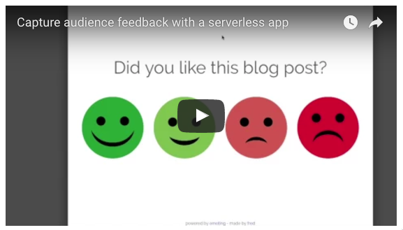

# nuv-emoji-voting

A demo of Nuvolaris.io serverless FaaS for a vanilla HTML/CSS/JS web app forntend

This is heavily based on an OpenWisk tutorial by [IBM](https://github.com/IBM-Bluemix/openwhisk-emoting) and [fred](https://twitter.com/l2fprod)

